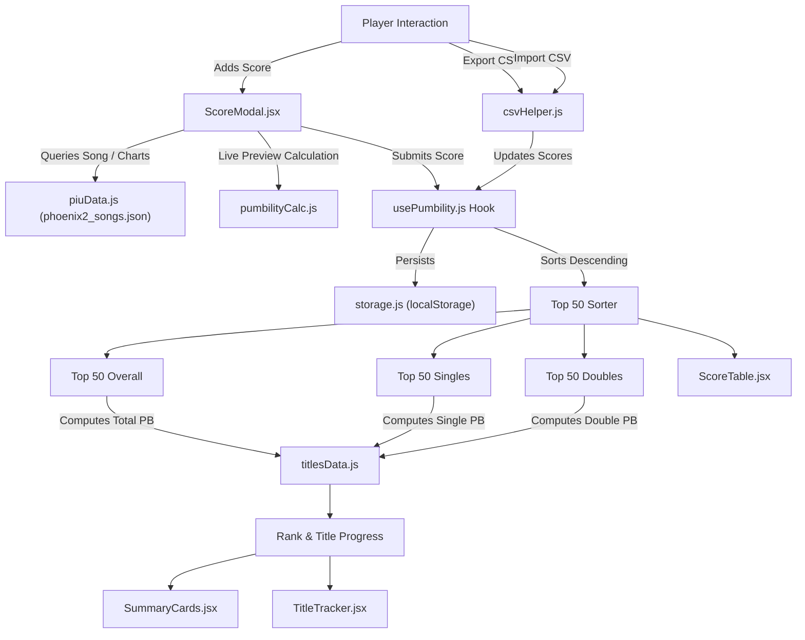

# Pump It Up Phoenix 2 - Technical Architecture & Component Reference

This document provides a comprehensive technical breakdown of every component, utility, hook, data asset, and configuration file in the **Pumbility & Title Calculator** web application.

---

## 📁 Repository Directory Structure

```
pumbility-calculator-react/
├── .github/
│   └── workflows/
│       └── deploy.yml              # Automated CI/CD pipeline for GitHub Actions & GitHub Pages
├── public/
│   ├── favicon.svg                 # Application favicon
│   ├── icons.svg                   # Sprite / vector iconography
│   └── piupad.svg                  # Standalone 5-arrow arcade pad SVG graphic
├── src/
│   ├── assets/
│   │   ├── hero.png                # Arcade visual artwork asset
│   │   ├── piupad.svg              # 5-panel arcade pad SVG icon for the Navbar
│   │   ├── react.svg               # React logo asset
│   │   └── vite.svg                # Vite logo asset
│   ├── components/
│   │   ├── layout/
│   │   │   └── Navbar.jsx          # Header navigation, brand logo, quick stats & import/export
│   │   ├── pumbility/
│   │   │   ├── PlateBadge.jsx      # Visual badges for clear plates (PG to RG) & modes
│   │   │   ├── ScoreModal.jsx      # Interactive modal to add/edit chart plays with live PB preview
│   │   │   ├── ScoreTable.jsx      # Sortable, searchable score records table with Top 50 tabs
│   │   │   ├── SummaryCards.jsx    # Stat summary cards (Total PB, Single Title, Double Title)
│   │   │   └── TitleTracker.jsx    # Interactive ladder tracker with Overall, Single, & Double tabs
│   │   └── ui/
│   │       ├── Button.jsx          # Reusable styled action button
│   │       └── Modal.jsx           # Accessible modal container with backdrop blur
│   ├── data/
│   │   ├── phoenix2_songs.json     # 650 verified songs & step chart database with BPM and levels
│   │   └── titlesData.js           # Exact threshold definitions for Overall Tiers & Single/Double titles
│   ├── hooks/
│   │   └── usePumbility.js         # Core custom hook: Top 50 sorting, ratings, CRUD, and persistence
│   ├── services/
│   │   └── piuData.js              # Song search engine with typo/punctuation tolerance & chart extractor
│   ├── utils/
│   │   ├── csvHelper.js            # RFC-compliant CSV parser and exporter for score portability
│   │   ├── pumbilityCalc.js        # Phoenix 2 mathematical calculation engine & rounding rules
│   │   └── storage.js              # Safe LocalStorage wrapper with error handling
│   ├── App.jsx                     # Root application layout & global state wiring
│   ├── index.css                   # Global styles & Tailwind CSS v4 directives
│   └── main.jsx                    # React 19 entry point and DOM root mount
├── .gitignore                      # Git ignore specifications
├── eslint.config.js                # ESLint flat configuration for React 19 & modern JS
├── index.html                      # HTML5 entry template with viewport configuration
├── package.json                    # Project dependencies and script runner commands
├── README.md                       # Project overview and quickstart guide
├── DOCUMENTATION.md                # Comprehensive technical reference (this file)
└── vite.config.js                  # Vite bundler configuration and build options
```

---

## ⚙️ Configuration Files

### 1. `package.json`
- **Purpose**: Defines project metadata, npm scripts, and dependencies.
- **Key Dependencies**:
  - `react` (`^19.0.0`) & `react-dom` (`^19.0.0`): Latest React runtime with optimized rendering.
  - `lucide-react`: Modern SVG icon library used across interactive buttons and badges.
  - `tailwindcss` (`^4.0.0`): Zero-runtime utility-first CSS framework.
  - `@tailwindcss/vite`: Official Vite plugin for Tailwind CSS v4.
  - `vite` (`^6.0.0` or `^8.0.0`): Instant HMR dev server and Rollup/Rolldown production bundler.
- **Key Scripts**:
  - `npm run dev`: Launches Vite development server on `localhost:5173`.
  - `npm run build`: Bundles the application into minified static assets in `dist/`.
  - `npm run preview`: Previews the production bundle locally.
  - `npm run lint`: Runs ESLint across all source files.

### 2. `vite.config.js`
- **Purpose**: Configures Vite compilation plugins and base URLs.
- **Key Settings**:
  - React plugin (`@vitejs/plugin-react`) for fast JSX transform.
  - Tailwind CSS plugin integration (`@tailwindcss/vite`).
  - Base path configuration (`base: './'` or `/pumbility-calculator-react/`) to allow direct static hosting on GitHub Pages or custom subdirectories without path breakage.

### 3. `eslint.config.js`
- **Purpose**: Modern ESLint flat configuration.
- **Key Rules**:
  - Validates JSX syntax, React hooks rules (`react-hooks/rules-of-hooks`, `react-hooks/exhaustive-deps`).
  - Flags unused variables and syntax errors.

### 4. `.github/workflows/deploy.yml`
- **Purpose**: Automated CI/CD pipeline triggered on pushes to the default branch.
- **Stages**:
  1. **Checkout**: Checks out source code.
  2. **Setup Node.js**: Installs Node.js LTS environment with caching.
  3. **Lint**: Executes `npm run lint` to enforce code quality before deployment.
  4. **Build**: Executes `npm run build` to generate production assets.
  5. **Deploy**: Automatically deploys the `dist/` folder to GitHub Pages via `actions/deploy-pages`.

### 5. `src/index.css`
- **Purpose**: Global styling sheet importing Tailwind CSS v4 (`@import "tailwindcss";`) and custom styling for arcade-themed glowing text, subtle scrollbars, and dark slate backgrounds.

---

## 🧠 Core Calculations & Business Logic

### `src/utils/pumbilityCalc.js`
The central mathematical engine of the application. Re-implements the Phoenix 2 scoring model:

$$\text{Pumbility} = \lfloor ((\text{Grade Points} + \text{Plate Bonus}) \times \text{Weight} + 10^{-6}) \times 100 \rfloor / 100$$

1. **Grade Points (`GRADE_POINTS`)**:
   - `SSS+`: 375.0 pts (Score: 995,000+)
   - `SSS`: 372.5 pts (Score: 990,000+)
   - `SS+`: 370.0 pts (Score: 985,000+)
   - `SS`: 367.5 pts (Score: 980,000+)
   - `S+`: 365.0 pts (Score: 975,000+)
   - `S`: 362.5 pts (Score: 970,000+)
   - `AAA+`: 357.5 pts (Score: 960,000+)
   - `AAA`: 352.5 pts (Score: 950,000+)
   - `AA+`: 347.5 pts (Score: 940,000+)
   - `AA`: 342.5 pts (Score: 920,000+)
   - `A+`: 337.5 pts (Score: 900,000+)
   - `A`: 330.0 pts (Score: 825,000+)
   - `B`: 320.0 pts, `C`: 300.0 pts, `D`: 250.0 pts, `F`: 0.0 pts
2. **Clear Plate Bonus (`PLATE_BONUSES`)**:
   - `PG` (Perfect Game): `+5.00`
   - `UG` (Ultimate Game): `+4.25` for Single / `+4.00` for Double
   - `EG` (Extreme Game): `+3.50`
   - `SG` (Superb Game): `+2.00`
   - `MG` (Marvelous Game): `+1.50`
   - `TG` (Talented Game): `+1.00`
   - `FG` (Fair Game): `+0.50`
   - `RG` (Rough Game): `+0.00`
3. **Weight Scaling (`getWeightMultiplier`)**:
   - **Double (D)**:
     - Level 10 to 24: $0.52 + (0.02 \times \text{Level})$ (D24 = 1.00)
     - Level 25+: Accelerates by $+0.04$ per level (D25 = 1.04, D26 = 1.08, D27 = 1.12, D28 = 1.16)
   - **Single (S)**:
     - Offset by $+1$ level: $S_{\text{Level}} = D_{\text{Level} + 1}$ (e.g. S22 uses weight of D23 = 0.98; S23 uses D24 = 1.00)
4. **Trunk / Floor Precision**:
   - Multiplied by 100, floored, then divided by 100 to yield exact 2-decimal truncation matching PIU arcade leaderboards.

---

### `src/data/titlesData.js`
Contains the rating thresholds for Overall Gem Tiers and Single/Double skill title ladders.

1. **Overall Gem Tiers (`OVERALL_TIERS`)**:
   - Bronze: 0 PB
   - Silver: 10,000 PB
   - Gold: 13,000 PB
   - Platinum: 15,000 PB
   - Diamond 1 to 5: 17,000 – 17,800 PB (step: +200 PB)
   - Red Beryl 1 to 5: 18,000 – 18,800 PB (step: +200 PB)
   - Alexandrite 1 to 5: 19,000 – 19,800 PB (step: +200 PB)
   - Abyss Absolute: 20,000+ PB
2. **Single Titles (`SINGLE_TITLES`) & Double Titles (`DOUBLE_TITLES`)**:
   - **Intermediate Lv.1 – Lv.10**: 5,000 to 14,000 PB (step: +1,000 PB per level)
   - **Advanced Lv.1 – Lv.10**: 15,000 to 17,250 PB (step: +250 PB per level)
   - **Expert Lv.1 – Lv.6**: 17,500 to 18,500 PB (step: +200 PB per level)
   - **Expert Lv.7 – Lv.10**: 18,600 to 18,900 PB (step: +100 PB per level)
   - **Master**: 19,000+ PB
3. **`getTitleProgress(pumbility, tierList)`**:
   - Traverses the tier array to find the current active title.
   - Computes progress percentage `[0 - 100%]`, next title name, and remaining PB needed.

---

### `src/data/phoenix2_songs.json`
- Comprehensive static database containing **650 Pump It Up songs** compiled from official game revisions (up to Phoenix 2 v1.00.0+).
- Each song includes: `songID`, `songName`, `artist`, `bpm`, and `chartList` (`chartType: "single" | "double"`, `level`).
- Includes iconic legacy charts.

---

### `src/services/piuData.js`
- **`getPiuSonglist(forceRefresh)`**: Returns the bundled Phoenix 2 song list, ensuring zero network latency and reliable offline availability.
- **`searchSongs(query, songlist)`**:
  - Normalizes input by removing diacritics, accents, and punctuation.
  - Features an alias dictionary mapping common typos and phonetic variants (`"lapus"` $\rightarrow$ `"larpus"`, `"queem"` $\rightarrow$ `"queen"`, `"banya"` $\rightarrow$ `"banya"`).
  - Performs multi-word intersection matching across both song titles and artist names.
- **`extractSongCharts(song)`**: Filters charts to level $\ge 10$ (the eligible threshold for Pumbility calculation) and sorts Single charts first, ascending by level.

---

### `src/utils/csvHelper.js`
- **`exportScoresToCsv(scores, filename)`**: Serializes current score records into RFC-4180 compliant CSV format, quoting values containing commas or quotes, and triggers a browser download.
- **`parseScoresCsv(csvText)`**:
  - Parses uploaded CSV files with support for quoted strings.
  - Automatically identifies columns regardless of header casing or ordering (`songName`, `type`, `level`, `score`, `grade`, `plate`, `date`).
  - Re-calculates and validates Pumbility scores to prevent corrupted imports.

---

### `src/utils/storage.js`
- Manages `localStorage` persistence under key `pumbility_scores_v2`.
- Handles JSON serialization and deserialization with `try...catch` guards to prevent app crashes if browser storage quota is exceeded or storage is disabled.

---

### `src/hooks/usePumbility.js`
Custom state hook that serves as the single source of truth for all score and title computations:
- **`scores`**: Array of all saved chart records (automatically deduplicated by chart key).
- **Chart Uniqueness & Deduplication**:
  - Each step chart is uniquely identified by `getChartKey(item)`: `${normalizedSongName}__${type}__${level}`.
  - `deduplicateScores()` ensures that a player can only have one personal best record per unique chart.
  - Adding a score for an existing chart automatically updates the chart in-place if the result is changed, or rejects duplicate entries if the grade and plate are identical.
- **`top50Overall`**: Sorted slice of the highest 50 unique chart scores regardless of mode.
- **`top50Singles`**: Sorted slice of top 50 Single (`S`) scores.
- **`top50Doubles`**: Sorted slice of top 50 Double (`D`) scores.
- **`totalPumbility`**: Sum of `top50Overall` scores (rounded to 2 decimal places).
- **`singlePumbility`**: Sum of `top50Singles` scores.
- **`doublePumbility`**: Sum of `top50Doubles` scores.
- **`averagePumbility`**: Mean score per chart in the Top 50.
- **`overallTier`**, **`singleTitle`**, **`doubleTitle`**: Live progression objects computed by `getTitleProgress()`.
- **CRUD Operations**: `addScore`, `updateScore`, `deleteScore`, `clearAll`, `importScores`, and `loadSampleScores`.

---

## 🎨 UI & Layout Components

### 1. `src/components/layout/Navbar.jsx`
- Sticky header featuring the iconic 5-panel PIU arcade pad logo (`piupad.svg`).
- Quick pill showing active Overall Gem Tier and Total Pumbility.
- Action triggers:
  - **Demo Data**: Seeds initial realistic scores for new visitors.
  - **Import CSV**: Opens file picker to upload and merge/replace scores.
  - **Export CSV**: Triggers instant download of player scores.
  - **Clear**: Empties state and LocalStorage with confirmation.
  - **Add Score**: Opens the score entry modal.

### 2. `src/components/pumbility/SummaryCards.jsx`
Displays three cyber-arcade summary metric panels:
1. **Top 50 Pumbility**: Shows total PB, glowing rank badge, progress bar towards next gem rank, and average score per chart.
2. **Single Title**: Shows Single PB, active Single title badge, progress bar towards next level, and formula weighting indicator (`S = D+1`).
3. **Double Title**: Shows Double PB, active Double title badge, progress bar, and formula scale pivot indicator (`D24 = 1.00`).

### 3. `src/components/pumbility/TitleTracker.jsx`
Interactive tabbed title ladder with two viewing modes:
- **Tabs**:
  - `Overall Gem Tiers`: Tracks Bronze to Abyss Absolute.
  - `[S] Single Titles`: Tracks Intermediate Lv.1–10, Advanced Lv.1–10, Expert Lv.1–10, and The Master.
  - `[D] Double Titles`: Tracks Intermediate Lv.1–10, Advanced Lv.1–10, Expert Lv.1–10, and The Master.
- **Category Tiles**: Displays milestone cards indicating `CURRENT`, reached, or upcoming milestones.
- **Expanded Breakdown**: Shows a detailed table of every level threshold, status (`✓ Cleared`, `ACTIVE`, or `+X.XX PB needed`), and exact difference.

### 4. `src/components/pumbility/ScoreModal.jsx`
Modal dialog for adding or editing chart scores:
- **Song Search**: Fast autocomplete input connected to `searchSongs()`.
- **Chart Selector**: Shows clickable chips for all available charts ($\ge 10$) of the selected song.
- **Mode Toggle**: High-contrast buttons for Single (`S`) and Double (`D`).
- **Level Dropdown**: Selectable chart levels (10 to 28).
- **Grade & Plate Selectors**: Standard arcade grades (`SSS+` down to `A+`) and plates (`PG` down to `RG`).
- **Exact Score Input**: Optional score input (0 to 1,000,000) that automatically calculates and selects the corresponding grade.
- **Live Calculation Breakdown**: Real-time card demonstrating the exact formula components `(Grade + Plate) * Weight` and the resulting Pumbility.

### 5. `src/components/pumbility/ScoreTable.jsx`
Tabbed scores view:
- **Tabs**: `Top 50 Overall`, `Top 50 Singles`, `Top 50 Doubles`, and `All Saved`.
- **Search & Sort**: Filter by song name or chart label (e.g. `s20`, `d24`), sort by Pumbility (highest), Chart Level (highest), or Date (newest).
- **Badges**: Clear plate badges with official color schemes and Single/Double badges.
- **Row Actions**: Edit score (opens `ScoreModal`) or Delete score.

### 6. `src/components/pumbility/PlateBadge.jsx`
Presents arcade plate indicators:
- `PG` (Rainbow/Gold glow)
- `UG` (Platinum/Cyan glow)
- `EG` (Gold/Yellow)
- `SG` (Silver/Cyan)
- `MG` (Bronze/Amber)
- `TG` / `FG` / `RG` (Slate/Neutral)
- Mode Badges: Red for Single (`S`), Emerald for Double (`D`).

### 7. `src/components/ui/Modal.jsx` & `Button.jsx`
- Accessible backdrop blur modal with Esc key listener and focus management.
- Reusable cyberpunk/arcade styled button variants.

---

## 🔁 Complete Data Flow Lifecycle



---

## 🧪 Verification & Quality Standards

1. **Linting**:
   ```bash
   npm run lint
   ```
   Maintains zero ESLint warnings or errors across all files.

2. **Production Build**:
   ```bash
   npm run build
   ```
   Compiles into a zero-warning optimized bundle in `dist/`.

3. **Math & Logic Integrity**:
   - Verified that scores truncate rather than round up.
   - Single offset `S = D + 1` applies correctly to weights.
   - Title progression handles boundary conditions (e.g. exactly 17,500 PB registers as `Expert Lv.1`).

